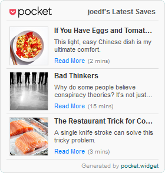
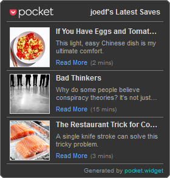

# pocket.widget
 
Simple widget to showcase your latest saved articles on [Pocket](https://getpocket.com).

**Note:** Pocket is shutting down or has been shutdown. For more information, see here: https://support.mozilla.org/en-US/kb/future-of-pocket

## Usage
Simply run `pocket-api.py 1234-abcd1234abcd1234abcd1234` with your [consumer key](https://getpocket.com/developer/docs/authentication) to generate the `widget.html` in the `src\web` folder.

You can specify additional parameters like so: `pocket-api.py [consumer_key] [access_code] [access_token]`.

The script will attempt (if `ALLOW_SAVE_KEYS` is true) to save any keys, codes, and tokens as the following files:
- `src\ACCESS_CODE`
- `src\ACCESS_TOKEN`
- `src\CONSUMER_KEY`

These will be used for subsequent runs.

### Options
- Compact size: You can toggle compact size by setting the `compact` class on the body tag. Compact mode is about 46% smaller.
- Dark mode: You can toggle dark mode by specifying `?theme=dark` after the generated html page address.

## Screenshots

### Full Size

### Compact Size

